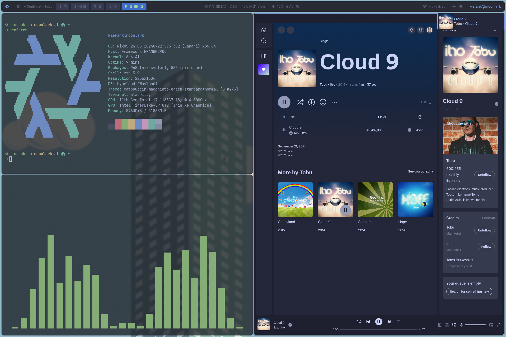

# Kieran's Dots



> [!CAUTION]
> These dots are highly prone to change / breakage. I am not a nix os expert (this is my first time touching nix), so I'm not sure if this will work or not. I'm just trying to get my dots up on github. If you have any suggestions, please let me know.

## The layout

```bash
/etc/nixos
├── home-manager - all the config's that use home manager and stored centraly here
│   ├── app - any apps that have home manager configs like neovim get a file here
│   ├── dots - any config files that need to be symlinked go here eg my hyprland config
│   ├── machines - the different machines by hostname
│   │   └── moonlark - my framework laptop
│   └── wm - window manager config; honestly it could probly be moved to app/hyprland
│       └── hyprland - hyprland config
├── moonlark - the files pertaining to my moonlark machine that aren't home manager related
└── secrets - any secrets that are encrypted with agenix go here

10 directories
```

## Installation

~~I have absolutely no idea~~ I kinda understand now?

1. Install NixOS via the [official guide](https://nixos.org/download.html)
2. `sudo -i`
3. Enable git with `sed -i 's/^{$/{\n  programs.git.enable = true;/' /etc/nixos/configuration.nix` and then run `nixos-rebuild switch`
4. Download the disk config with `curl https://github.com/kcoderhtml/dots/raw/master/moonlark/disk-config.nix -o /tmp/disk-config.nix`
5. Run disko with `nix --experimental-features "nix-command flakes" run github:nix-community/disko -- --mode disko /tmp/disk-config.nix`
6. Mount disk with `mount | grep /mnt` and then `cd /mnt/etc/nixos`
7. Clone this repo to your `/mnt/etc/nixos` folder with `git clone https://github.com/kcoderhtml/dots.git .`
8. Add your ssh private key to `/mtn/etc/ssh/id_rsa` 
9. install the flake: `nixos-install --flake .#moonlark --no-root-passwd`
10. Once it finishes run nix install and then reboot
```bash
nixos-install
reboot
```
11. Pray to the nix gods that it works 🙏
12. If it worked then you should be able to login with the user `kierank` and the password `lolzthisaintsecure!`
13. Change the password with `passwd kierank`
14. Move the config to your local directory with `mkdir ~/etc; sudo mv /etc/nixos ~/etc`
15. Link the config back to `/etc/nixos` with `sudo ln -s ~/etc/nixos /etc`
16. Change the config permissions: `sudo chown -R $(id -un):users ~/etc/nixos`, `sudo chown kierank -R ~/etc/nixos`, and `sudo chown kierank -R ~/etc/nixos/.*`
17. Setup the fingerprint reader with `sudo fprintd-enroll -f right-index-finger kierank` and then verify it worked with `sudo fprintd-verify kierank` (you may need to swipe your finger across the fingerprint sensor instead of simply laying it there)

## Screenshots
<details>
    <summary>I've stuck the rest of the screenshots in a spoiler to preserve space</summary>


</details>

## Credits

Thanks a bunch to the following people for their dots, configs, and general inspiration which i've shamelessly stolen from:

- [NixOS/nixos-hardware](https://github.com/NixOS/nixos-hardware)
- [hyprland-community/hyprnix](https://github.com/hyprland-community/hyprnix)
- [spikespaz/dotfiles](https://github.com/spikespaz/dotfiles)
- [Misterio77/nix-starter-configs](https://github.com/Misterio77/nix-starter-configs)
- [mccd.space install guide](https://mccd.space/posts/git-to-deploy/)
- [disco docs](https://github.com/nix-community/disko/blob/master/docs/quickstart.md)
- [XDG_CONFIG_HOME setting](https://github.com/NixOS/nixpkgs/issues/224525)
- [Daru-san/spicetify-nix](https://github.com/Daru-san/spicetify-nix)
- [agenix](https://nixos.wiki/wiki/Agenix)
- [wpa_supplicant env file docs](https://search.nixos.org/options?show=networking.wireless.environmentFile&from=0&size=50&sort=relevance&type=packages&query=networking.wireless)
- [escaping nix variables](https://www.reddit.com/r/NixOS/comments/jmlohf/escaping_interpolation_in_bash_string/)
- [nerd fonts cheat sheet](https://www.nerdfonts.com/cheat-sheet)
- [setting the default shell in nix](https://www.reddit.com/r/NixOS/comments/z16mt8/cant_seem_to_set_default_shell_using_homemanager/)
- [hyprwm/contrib](https://github.com/hyprwm/contrib)
- [gtk with home manager](https://hoverbear.org/blog/declarative-gnome-configuration-in-nixos/)
- [setting up the proper portals](https://github.com/NixOS/nixpkgs/issues/274554)
- [tuigreet setup](https://github.com/sjcobb2022/nixos-config/blob/29077cee1fc82c5296908f0594e28276dacbe0b0/hosts/common/optional/greetd.nix)
